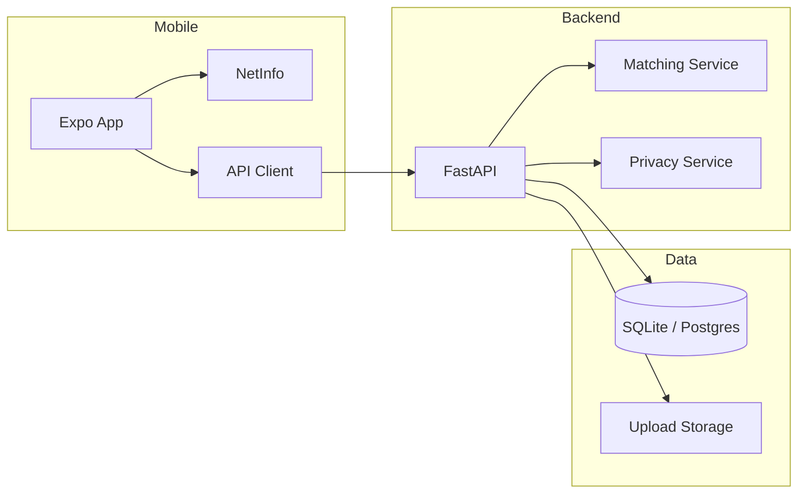

# Architecture

## System overview



## Core flows

### Report lost valuable

1. User takes photo + selects category/location
2. Backend validates category (valuables only)
3. Generates image + text embeddings
4. Saves item with status `open`
5. Runs matching against open found items
6. If `is_urgent`, future: push notification to campus

### Report found valuable

Same as above, matching runs against open **lost** items.

### Privacy-gated contact

1. Owner sees AI match on lost item detail
2. Owner taps **This is mine** → creates `ClaimRequest` (pending)
3. Finder sees VTU ID + masked name in Incoming Requests
4. Finder **Accept** → both receive full name + phone, status `connected`
5. Finder **Reject** → no phone shared, items return to `matched`

## Database entities

- `users` — VTU ID, name, dept, email, phone (phone hidden by API rules)
- `items` — lost/found reports with embeddings
- `matches` — AI scores between lost/found pairs
- `claim_requests` — mutual consent workflow

## AI matching (MVP)

```
combined_score = 0.6 × image_similarity + 0.4 × text_similarity
```

Threshold default: `0.55` (configurable in backend `.env`).

Upgrade path: replace `services/embeddings.py` with CLIP + MiniLM without changing API contracts.
