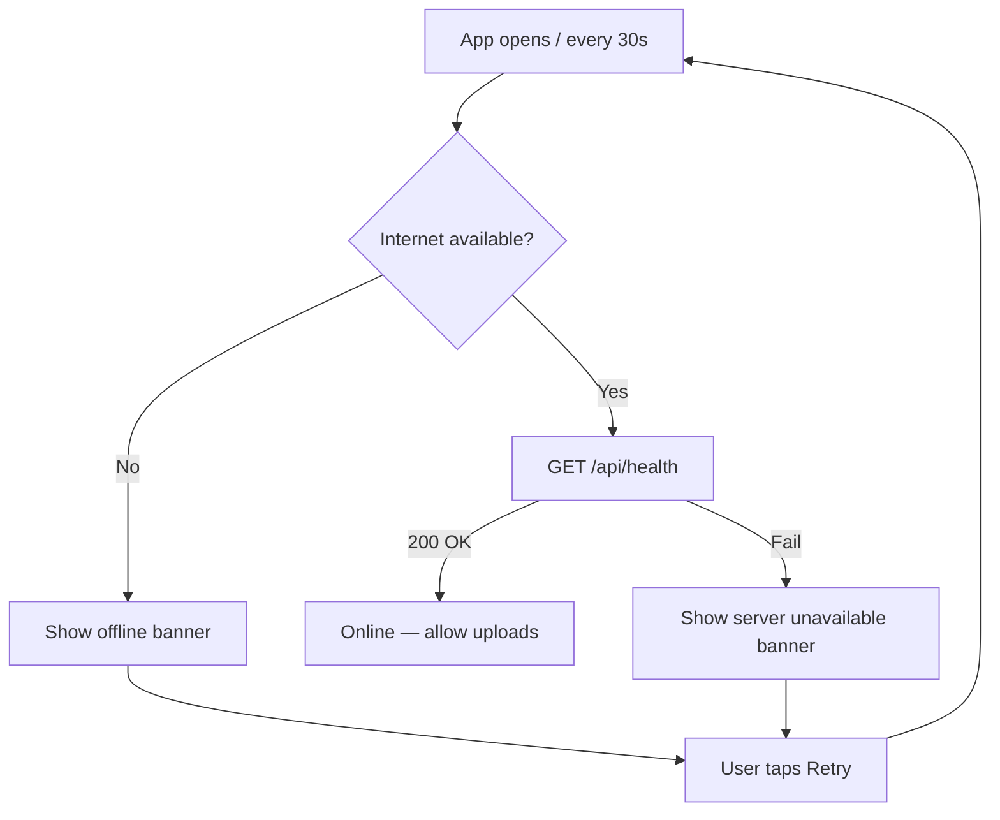

# Server connection guide

This document explains how the mobile app talks to the FastAPI backend, and how to fix common connection issues.

## How connection checking works



### States shown in the app

| State | Meaning | User sees |
|-------|---------|-----------|
| `online` | Internet + backend healthy | No banner |
| `offline` | No Wi‑Fi / mobile data | "You are offline" |
| `server_down` | Internet OK but API unreachable | "Server unavailable" |
| `checking` | Testing connection | Brief check on launch |

## API URL configuration

Set in `mobile/.env`:

```env
EXPO_PUBLIC_API_URL=http://192.168.1.42:8000
```

Restart Expo after changing `.env` (`npm start` again).

### Why `127.0.0.1` fails on a physical phone

`127.0.0.1` means **the phone itself**, not your laptop. Use your computer's LAN IP instead.

### Android emulator

Use the special alias to reach the host machine:

```env
EXPO_PUBLIC_API_URL=http://10.0.2.2:8000
```

## Request behaviour

Every API call in `mobile/src/api/client.ts`:

1. Sends request with **15 second timeout**
2. Retries up to **2 times** on network/timeout errors (not on validation errors)
3. Maps failures to user-friendly messages:
   - **offline** — cannot reach server at all
   - **timeout** — server too slow or wrong URL
   - **unauthorized** — login again
   - **validation** — show backend message (e.g. "Only valuable items allowed")
   - **server** — 500 errors

Uploading a report uses **retries: 0** to avoid duplicate submissions.

## Starting the backend correctly

The server must bind to all interfaces so your phone can connect:

```powershell
cd backend
.\venv\Scripts\activate
uvicorn app.main:app --reload --host 0.0.0.0 --port 8000
```

Windows Firewall may prompt you — allow access on private networks.

## Test checklist

1. Open http://127.0.0.1:8000/api/health in your PC browser → `{"status":"ok"}`
2. Open http://YOUR_LAN_IP:8000/api/health on your phone browser → same response
3. Open the app → no red banner
4. Register / login works
5. Upload a lost item with photo

## Troubleshooting

| Problem | Fix |
|---------|-----|
| Red "Server unavailable" banner | Start backend; check `EXPO_PUBLIC_API_URL`; use LAN IP on phone |
| Login works on web, not phone | Phone URL must use PC IP, not localhost |
| Upload hangs then times out | Firewall blocking port 8000; allow Python |
| Session expired | Log in again (token stored in SecureStore) |
| Image not showing | Ensure `image_url` resolves via same API base URL |

## Production (later)

- Deploy FastAPI to Render (`0.0.0.0:$PORT`)
- Use HTTPS URL in `EXPO_PUBLIC_API_URL`
- Move SQLite → PostgreSQL
- Store images in Cloudinary / S3 (Render filesystem is ephemeral)
